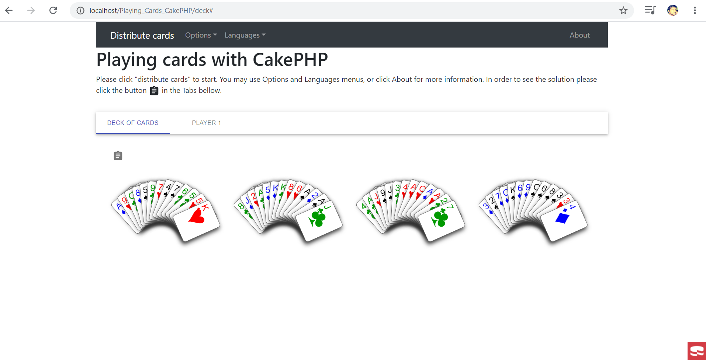
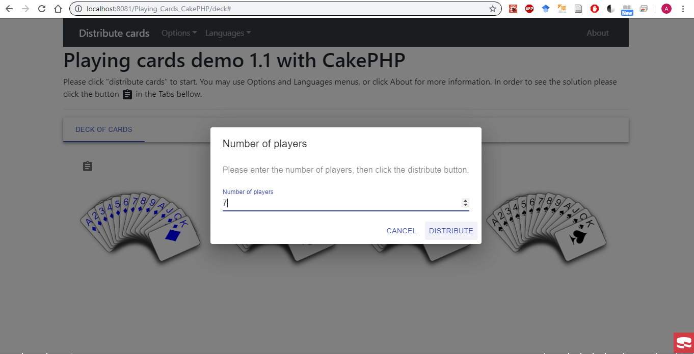
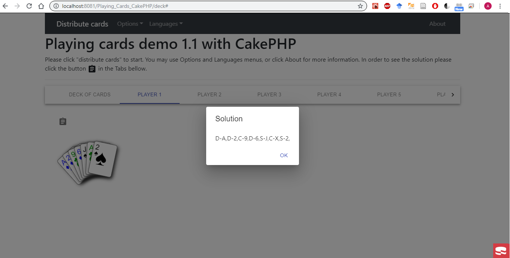
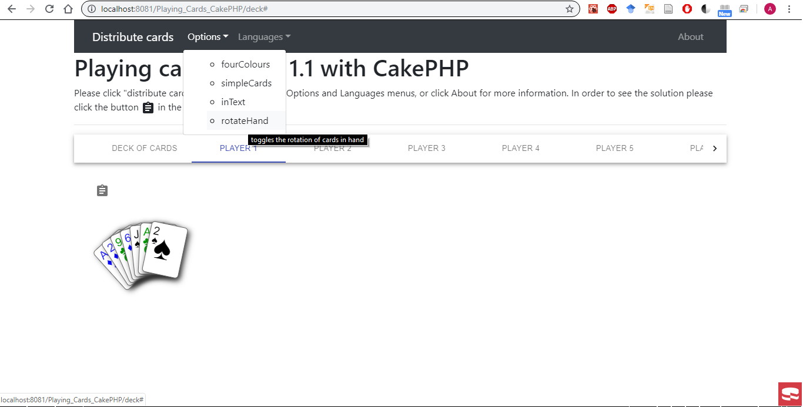
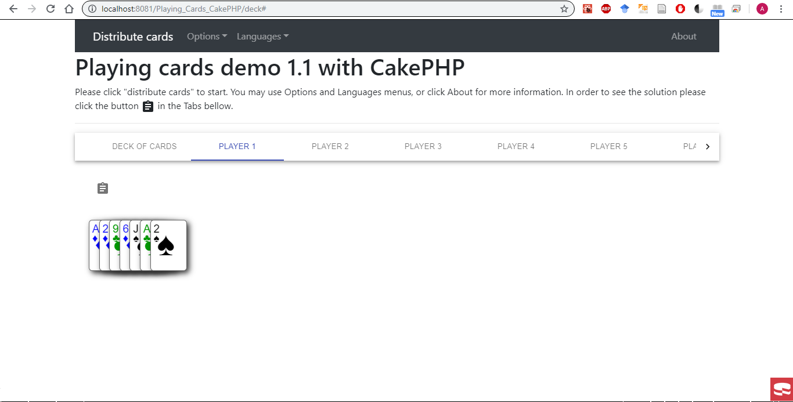
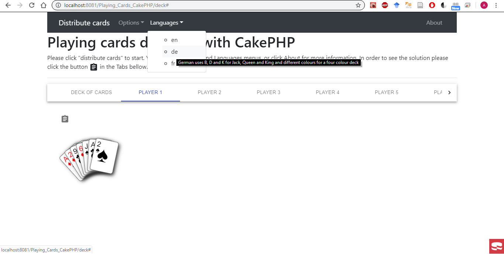
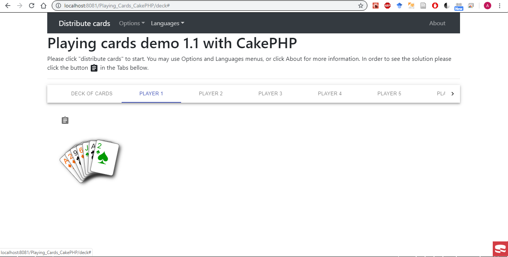
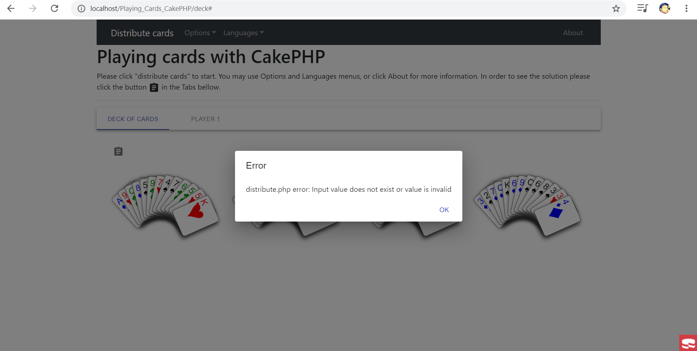
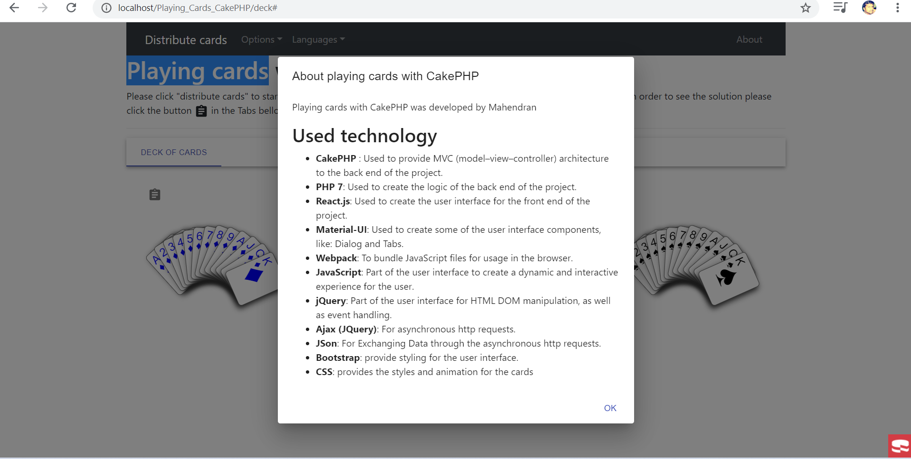

# Playing Cards CakePHP 
Playing cards with CakePHP was developed by mahendran
## Used technology 
* **CakePHP**: Used to provide MVC (model–view–controller) architecture to the back end of the project.
* **PHP 7**: used to create the logic of the back end of the project.
* **React.js**: used to create the user interface for the front end of the project.
* **Material-UI**: used to create some of the user interface components, like: Dialog and Tabs.
* **Webpack**: To bundle JavaScript files to be run in the browser.
* **Babel**: To compile JavaScript/"JavaScript XML" (js/jsx files) before bundle and send to the browser
* **JavaScript**: Part of the user interface to create a dynamic and interactive experience for the user.
* **jQuery**: Part of the user interface for HTML DOM manipulation, as well as event handling.
* **Ajax (JQuery)**: For asynchronous http requests.
* **JSon**: For Exchanging Data through the asynchronous http requests.
* **Bootstrap**: provide styling for the user interface.
* **CSS**: provides the styles and animation for the cards, 
## Translating from java to php to speed up the development process
 The files [Card.php](src/Cards_Lib/Card.php) and [DeckOfCards.php](src/Cards_Lib/DeckOfCards.php) 
## Installation 
* Download and install CakePHP as explained in [the official documentation of CakePHP](https://book.cakephp.org/3.0/en/installation.html).
* Download "Playing_Cards_CakePHP" as zip file (from the [repository](https://github.com/oudelham/Playing_Cards_CakePHP),  click the button "Clone or Download" then the button "Download ZIP"), then unzip it to the testing environment (apache web root directory eg: /var/www/html/).

* After downloading "Playing_Cards_CakePHP" project from github and unzipped it. Please enter the "Playing_Cards_CakePHP" project directory where you can see "composer.json" file. The Composer is used for dependency management in PHP. It allows to declare the libraries the project depends on and it will manage (install/update) them. The composer binary (.phar = PHP archive) need to be Download first in "Playing_Cards_CakePHP" project folder, then it will be used later to install the dependencies listed in "composer.json".
```
cd Playing_Cards_CakePHP
```
* Command to Download Composer binary file  "composer.phar"  (PHP archive):
```
curl -s https://getcomposer.org/installer | php
```
* Please run the following command to install dependencies listed in "composer.json" (including require-dev from "composer.lock"):
```
php composer.phar install
```
* Now you are ready to run "Playing_Cards_CakePHP", please run PHP server and point your browser to URL: http://[Url_To_PHP_Server]/Playing_Cards_CakePHP/deck/ the main page is served by the controller deck and the action index. The front-end React app is already compiled and bundled and ready to use.
## UTF-8 and line feed LF conditions
The requirement: program file (source code) character code must be UTF-8 and line feed code must be LF, is fulfilled in the [.editorconfig](.editorconfig).
## Full Stack web project details
### Server side (Back-end)
CakePHP MVC model is used in the back-end app. The main page of the app is handled by the [Deckcontroller](src/Controller/DeckController.php) and the index action like in the following URL http://[Url_To_PHP_Server]/Playing_Cards_CakePHP/deck/. When the app starts in the client's browser [index.js](webroot/js/src/app/index.js) will create the React components that represents the user interface. Then handles the users' clicks and sends JQyery AJax request to the [Deckcontroller](src/Controller/DeckController.php) which will render a JSon object that contains a string representation of the set of cards as required in the [interview question] by using the Objects:  [Distribution](src/Cards_Lib/Distribution.php) and [DeckOfCards](src/Cards_Lib/DeckOfCards.php)
* **[Distribution](src/Cards_Lib/Distribution.php)**: Holds a string representation of the Object: [DeckOfCards](src/Cards_Lib/DeckOfCards.php) as required in the [interview question]
* **[DeckOfCards](src/Cards_Lib/DeckOfCards.php)**: Creates a set of [Card](src/Cards_Lib/Card.php) object to represent the players cards.
* **[Card](src/Cards_Lib/Card.php)**: Contains the cards properties such as Suit: HEART, CLUB, SPADE and DIAMOND, as well as its Rank: A, 2, 3, 4, 5, 6, 7, 8, 9, X, J, Q, K.
  

### Client Side (Front-end)
The source code for React front-end app is located in the folder "webroot/js/src/app". The main file is [index.js](webroot/js/src/app/index.js) Handles the JQuery Ajax calls to back-end controllers created in CakePHP and recieves the JSon data to display it page's React components. As well as it creates the React components [Header](webroot/js/src/app/components/Header.js)and [Home](webroot/js/src/app/components/Home.js)
* **[Header](webroot/js/src/app/components/Header.js)**: Creates the navbar of the app as well as the links and the menu.
* **[Home](webroot/js/src/app/components/Home.js)**: Creates the component [CardsTabs](webroot/js/src/app/components/CardsTabs.js).
* **[CardsTabs](webroot/js/src/app/components/CardsTabs.js)**: Creates the material-ui component Tabs which will which will contain the component [HandOfCards](webroot/js/src/app/components/HandOfCards.js) which will display the players' cards.
* **[HandOfCards](webroot/js/src/app/components/HandOfCards.js)**: Creates a set of components   [Card](webroot/js/src/app/components/Card.js) which will display one card.
* **[Card](webroot/js/src/app/components/Card.js)**: Displays one card.
* **[Alert](webroot/js/src/app/components/Alert.js)**: Created by [index.js](webroot/js/src/app/index.js) as hidden component to display Error and About dialogs.
* **[ModalDialog](webroot/js/src/app/components/ModalDialog.js)**: Created by [index.js](webroot/js/src/app/index.js) as hidden component to to imput the number of players.
### Client Side (Front-end) rebundling and compilation
* **Install npm**: npm package manager is required for the front-end React project. npm is part of Node.js which can be downloaded from [Node.js download web page](https://nodejs.org/en/download/)
* **Install The dependencies of the React front-end app**: The file [package.json](webroot/js/package.json) contains the lists the packages the project depends on. When used with the param install npm will use [package.json](webroot/js/package.json) to install all the dependencies such as MaterialUi... into the folder "node_modules". 
```
npm install
```

* **Bundling and compiling the React front-end app**: When used with start param npm will compile the front-end app code located in folder "webroot/js/src" as well as it will compile the dependencies and bundle them into one file "webroot/js/dist/ReactApp/bundle.js" which will be sent to the browser at run time to show the web pages of the app.
```
npm start
```
## Playing_Cards_CakePHP app running in client web browser's screenshots
Main Page with a unshuffled deck of cards and no players


Input the number of players page


Page to show the solution for player 1 distribution as required in the [interview question](Interview%20Test%20Program%2022032019.pdf) 


menu options page


Page to show menu options rotate hand effect


menu language page


Page to show menu language Dutch effect


Error page


About page



